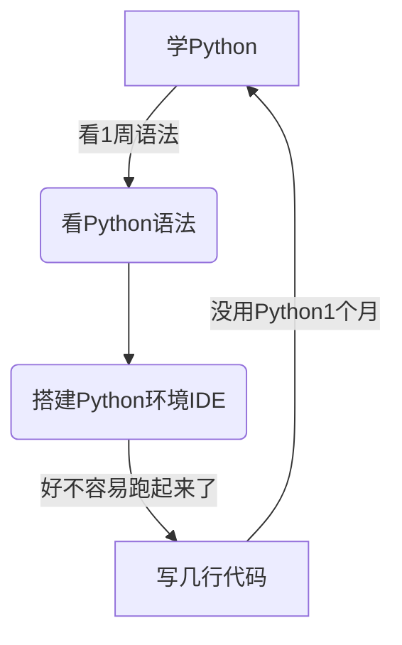

# 软件测试重学Python1: 学习Python的经历分析

> 记住: 不会有无缘无故的变好
 

回顾一下学习Python的经历,**看看学习Python的一些得失**.

先总结下来一些不好的地方: 

1. **时间太久**: 开始花了太多时间,学习语法和基础库
2. **目标不明确**: 没有具体的目标,投入产出不划算
3. **看的多,动的少**: 看的多.感觉不难;动手少,产出当然不多
4. **积累少**: 积累下来复用东西少,可以成体系的方案少
5. **工资**: 并没有因为多学了Python而涨工资,主要公司对我的定位是以一个团队管理同时兼顾技术
 
 

完全个人体会,仅供参考

---

## 学习Python的收获:

以下是一些收获: 

1. **坚持**: 终究还是坚持了下来,虽然花了太多时间
2. **熟练度**: 终究现在写Python代码还是比较自如,大部分小任务都能应付
3. **积累**: 终究积累一些通用Python的代码,可以在不同地方使用
4. **学习能力**：看文档能力有了很大提升, 常见的大部头文档可以快的找到自己需要的内容来解决实际问题
5. **代码思维**: 还是形成了一定可以复用的代码思维,可以复制解决类似问题
   
 
 
一些想法: 

> 1. 付出总有收获,固然没错;关键是付出有多大,收获有多大
> 2. 对于个人来说,付出成本低,收获涨工资是学习最好的结果和动力
> 3. 如何付出成本低,和方法有很大关系

---

## 学习Python前的背景

 

**自身的技术背景**:
1. 有自动化基础，做过JAVA的接口和UI自动化
2. JAVA处于能写状态,能解决脚本的问题
3. 业务和数据库SQL比较熟悉,之前大部分的背景都是业务测试,每天都和SQL打交道
---

## **为什么学习Python背景**：

 

1. 组内人员对于自动化脚本Python的接受程度更高
2. Python传说中学习成本低
3. 自认为多学一门语言挺快的
4. 多一门语言会多点工资

---

## 学习Python的方法和过程

回顾一下学习Python的方法过程,分几个阶段:

- 1.**学习语法阶段**
- 2.**学习常用库阶段**
- 3.**写自动化框架**
- 4.**不局限任何框架**,**积累代码**

--- 

### **学习语法阶段**
 

> 学习让人入迷,但是可能只是让自己感受好点,有点事情在做
 

1. 看了一遍语法
2. 尝试实现一个接口自动化框架，开始了项目，写了几行代码停滞了1个月忙业务测试
3. 过了1个月又看了一遍语法，又加了几段代码，继续忙
4. 循环1-3步2-3次，也就是2-3个月，发现效果不好

---

### **学习常用库阶段**
 
 

> 看的多,动的少,可惜事情是做出来的,不要被看到的信息所迷惑,你还是什么都没做

学习常用库: 这个阶段断断续续,看看停停从一开始的1-2个月,
到现在也没有停止

1. 发现第一阶段效果不好，就放弃一直学语法
2. 通过python module of week学标准库用法
3. 每三天学1-2个标准库用法
4. 坚持了2个月，还是没有实际产出
5. 这中间看了一些各种个样的框架什么django,flask,fastapi....,还是没有效果

---

### **写自动化框架**
 
 

> 在实践中检验吧.......

写Python的自动化框架:

1. 老板和团队的需求逼着我开始写接口自动化框架
2. 看到一个问题解决一个问题，终于摸出一个Python的自动化框架
3. 这个框架短期实施效果并不好,组员使用率50%不到
4. 写这个框架过程中还是学习了不少内容:
   1. 接口测试框架大体用到哪些内容
   2. 写框架可能会用到的Python的一些中阶内容
   3. python的包,模块，类，方法的一些机制

以上断断续续其实我猜花了超过2年时间，如果算上
一直在原地打转,然后终于有了一点产出，但是效果没有达到预期效果.
---

### **不局限任何框架**,**积累代码**

 
 

> 终于不在被叫什么理念所困惑, 管他叫什么, 问题解决了吗？工作量减少了, 加工资的机会更大了吗？

1. 有什么问题解决什么问题, 动手写点脚本满足日常要求
2. 不去想什么自动化框架之类的,日常的自动化其实不需要太多框架
3. 尽可能的和开发发明的理念统一,而不是同测试人员发明的理念统一, 因为这样你能找到更多的现成方法

比如关键字驱动:

> 关键字驱动,更像IoC/DI,控制反转和依赖注入;只是自动化测试人员说这个是关键字驱动,懂了IoC/DI可以更好的实现关键字

 
 

***如果重新学习Python,一定会用新的方式去做,怎么做,慢慢道来***
